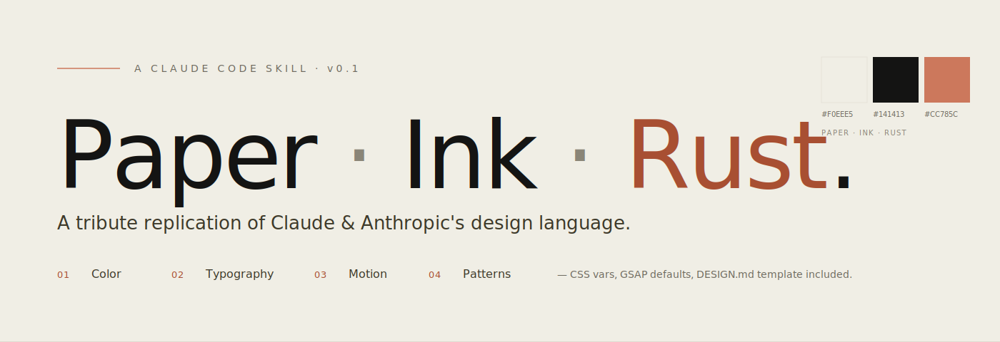

<div align="right">
  <details>
    <summary>🌐 Language</summary>
    <div>
      <div align="center">
        <a href="https://openaitx.github.io/view.html?user=Yacey&project=claude-design&lang=en">English</a>
        | <a href="https://openaitx.github.io/view.html?user=Yacey&project=claude-design&lang=zh-CN">简体中文</a>
        | <a href="https://openaitx.github.io/view.html?user=Yacey&project=claude-design&lang=zh-TW">繁體中文</a>
        | <a href="https://openaitx.github.io/view.html?user=Yacey&project=claude-design&lang=ja">日本語</a>
        | <a href="https://openaitx.github.io/view.html?user=Yacey&project=claude-design&lang=ko">한국어</a>
        | <a href="https://openaitx.github.io/view.html?user=Yacey&project=claude-design&lang=fr">Français</a>
        | <a href="https://openaitx.github.io/view.html?user=Yacey&project=claude-design&lang=de">Deutsch</a>
        | <a href="https://openaitx.github.io/view.html?user=Yacey&project=claude-design&lang=es">Español</a>
        | <a href="https://openaitx.github.io/view.html?user=Yacey&project=claude-design&lang=pt">Português</a>
        | <a href="https://openaitx.github.io/view.html?user=Yacey&project=claude-design&lang=ru">Русский</a>
      </div>
    </div>
  </details>
</div>

<p align="center">
  
</p>

<p align="center">
  <b>让 Claude Code 按 Claude 的品牌语言做设计的 Skill。</b><br/>
  <sub>一套可直接粘贴的色彩、排版、动效、组件模式,来自对 <code>claude.ai</code> / <code>anthropic.com</code> 的致敬性还原。</sub>
</p>

<p align="center">
  <a href="#快速安装">⚡ 快速安装</a> ·
  <a href="#这是什么">📖 这是什么</a> ·
  <a href="#设计理念">🎨 设计理念</a> ·
  <a href="#目录结构">📁 目录结构</a> ·
  <a href="#license--免责">⚖️ License &amp; 免责</a>
</p>

---

## 这是什么

**`claude-design`** 是一个 [Claude Code Skill](https://docs.claude.com/en/docs/claude-code/skills),装进去之后,当你让 Claude Code 做任何"设计类"工作 —— 网页、着陆页、幻灯片、视频合成、博客、海报 —— 它会自动按 Claude / Anthropic 公开可见的视觉语言来做:

- 暖米纸张底 `#F0EEE5`,不是纯白
- 深墨文字 `#141413`,不是纯黑
- 铁锈橙点缀 `#CC785C`,稀缺、有理由
- 衬线标题 × 中性无衬线正文
- 克制动效 · `expo.out` / `power4.out`,不用 bounce 和 elastic
- 大量留白,单列优先,细线分隔

skill 本体是纯文本 —— `SKILL.md` 约 13 KB,Claude Code 根据触发语义(详见 `SKILL.md` 顶部的 `description`)自动加载。

> **和其他设计系统的区别**: 没装这个 skill 的 LLM 倾向于用 Material 蓝、Tailwind 圆角、阴影卡片、霓虹渐变 —— 因为训练语料里这些是主流。`claude-design` 把约束明确写死,让每次生成稳定命中 "claude 味"。

## 快速安装

```bash
# 1) clone 到 Claude Code 的 skills 目录
git clone https://github.com/Yacey/claude-design.git ~/.claude/skills/claude-design

# 2) 打开一个新的 Claude Code 会话,让它帮你"用 Claude 风格做个 XXX"
#    skill 会根据你的任务自动激活
```

若你的 skills 目录不在默认位置,参考 [Claude Code Skills 文档](https://docs.claude.com/en/docs/claude-code/skills)。

验证安装:在 Claude Code 里随便问一句 `"用 Claude 风格给我做一个个人博客首页"` —— 如果背景是米纸、标题是衬线、点缀是铁锈橙,说明 skill 已生效。

## 设计理念

> 想象一篇深思熟虑的散文,印在一张轻微米黄、带极细纹理的厚纸上,偶尔用一支铁锈红钢笔画下标记或注释。**不是**产品落地页,**不是**dashboard,**不是**科技风。

### 对标参考

| ✓ 借鉴 | 借鉴的是 | ✗ 避免 | 避免的是 |
|---|---|---|---|
| The New York Times | 衬线排版、阅读体验、层级 | Stripe | 过度精致的企业 SaaS 感 |
| Kinfolk 杂志 | 留白、摄影式构图、克制 | Linear | 冷峻科技酷炫 |
| Are.na | 内容优先、低 chrome、文献感 | Apple 主页 | 玻璃质感、强光泽 |
| 早期个人博客 (Ghost / Medium) | 阅读体验、无干扰 | Vercel 着陆页 | 深黑 + 霓虹梯度 |

### 核心哲学

1. **白纸不是白的,黑字不是黑的** — 纯白和纯黑都会破坏质感
2. **留白是材质** — 大量留白不是"没装修完",是刻意
3. **字体承担视觉重任** — 而不是图形或渐变
4. **铁锈橙是节制的** — 整屏最多 3–5 处,每次出现都有理由
5. **动效是对读者的尊重** — 快、稳、不打扰

### 不可违反的硬规则(摘)

- 背景永不纯白 `#FFFFFF`,永远用米底
- 文字永不纯黑 `#000000`,用 `#141413` 暖偏
- 标题永远衬线,正文永远中性无衬线
- 禁用 `box-shadow` drop shadow,用 1px 细边代替
- 动效只用 `expo.out` / `power4.out` / `power3.out`,禁用 `bounce` / `elastic` / `back`
- 斜体是高级强调,比 `bold` 更 claude 味
- 圆角 4–10px,禁用 24px+ pill shape

完整规则见 [`SKILL.md`](SKILL.md#hard-rules违反即破坏风格)。

## 目录结构

```
claude-design/
├── SKILL.md                        # 入口,Claude Code 自动加载的一级约束
├── references/
│   ├── palette.md                  # 完整 Light/Dark 色板、WCAG 对照、语法高亮
│   ├── typography.md               # 字体栈、OpenType 特性、中文适配
│   ├── motion.md                   # 动效曲线、duration 规格、GSAP/CSS 等效
│   └── patterns.md                 # 15 个组件模式:eyebrow/hero/chapter/quote/...
├── assets/
│   ├── vars.css                    # 可直接粘贴的 CSS 变量全套(Light + Dark)
│   ├── gsap-defaults.js            # GSAP easing / duration / 常用入场 helpers
│   └── DESIGN.template.md          # 给 hyperframes 等项目的 DESIGN.md 模板
├── docs/
│   └── banner.svg                  # 本 README 的 banner(非 skill 必需)
├── LICENSE
└── README.md                       # 你正在读的文件
```

> **给 Claude Code 看的主入口是 `SKILL.md`**,其他文件是按需加载的分层引用。修改 skill 时,先改 `SKILL.md`,再动 `references/` 与 `assets/`。

## 一眼预览 — 核心 Token(v0.2 · 官方 swatch 对齐)

> **v0.2** 所有 token 已经从 `anthropic.com` 与 `claude.com` 的 `:root` CSS 自定义
> 属性里**实测校准**过。命名尽可能 1:1 保留官方 swatch 语义(`clay` / `ivory` /
> `slate`),方便未来对照更新。

### Light(Editorial mode · 默认)

| Token | Hex | 官方对应 | 角色 |
|---|---|---|---|
| `--bg` | `#FAF9F5` | ivory-light / gray-050 | **主纸底** |
| `--bg-soft` | `#F0EEE6` | ivory-medium / gray-150 | 次级面板 |
| `--bg-elevated` | `#E8E6DC` | ivory-dark / gray-200 | 卡片 |
| `--ink` | `#141413` | slate-dark / gray-950 | 标题 |
| `--text` | `#3D3D3A` | slate-medium / gray-700 | 正文 |
| `--muted` | `#5E5D59` | slate-light / gray-600 | 次要(AA) |
| `--border` | `#E8E6DC` | ivory-dark | 细边 |
| `--accent` | `#D97757` | **clay** | 主铁锈(装饰) |
| `--accent-hover` | `#C96442` | clay-interactive | 按钮 hover |
| `--accent-text` | `#C6613F` | accent | 文字用铁锈(AA) |

### Dark(Product mode · claude-code 风格)

| Token | Hex | 官方对应 | 角色 |
|---|---|---|---|
| `--bg` | `#1A1918` | gray-900 | 主深底 |
| `--bg-soft` | `#262624` | gray-800 | 次级 |
| `--ink` | `#FAF9F5` | gray-050 | 标题反白 |
| `--text` | `#B0AEA5` | cloud-medium / gray-400 | 正文 |
| `--muted` | `#87867F` | cloud-dark / gray-500 | 次要(AA) |
| `--accent` | `#D97757` | clay(同 light) | 铁锈 |
| `--accent-text` | `#E08B6D` | — | 暗底 AA 文字铁锈 |

**v0.2 新增**:完整 **gray ladder 20 阶**(gray-000 ~ gray-1000)和 **12 个
编辑次级 swatch**(olive / cactus / sky / heather / fig / coral / oat / peach /
kraft / manilla / plum / mineral)。见 [`references/palette.md`](references/palette.md)
与 [`references/brand-swatches.md`](references/brand-swatches.md)。

可粘贴的 CSS 见 [`assets/vars.css`](assets/vars.css)。

## 和 `/hyperframes` 配合

如果你也用 [HyperFrames](https://github.com/eze-is/hyperframes) 做视频合成,这个 skill 就是它的默认设计语言:

1. 新建 hyperframes 项目后,把 [`assets/DESIGN.template.md`](assets/DESIGN.template.md) 复制为项目根目录的 `DESIGN.md`
2. [`assets/vars.css`](assets/vars.css) 粘进合成的 `<style>` 顶部
3. [`assets/gsap-defaults.js`](assets/gsap-defaults.js) 粘到合成 `<script>` 顶部

剩下的 "claude 味" 会自然出来。

## License &amp; 免责

- **本仓库代码、文档、token 定义**: [MIT License](LICENSE)
- **Claude / Anthropic 品牌与商标**: 属 Anthropic PBC 所有。本仓库是**致敬性还原 (tribute replication)**,从公开可见的视觉产物(claude.ai、anthropic.com、Claude Code)观察抽象而成,不代表 Anthropic 官方立场,也不包含 Anthropic 的官方 logo、wordmark 或专有插图。
- **专有字体**: Tiempos / Styrene / Copernicus / Söhne 是 [Klim Type Foundry](https://klim.co.nz) 和 [Commercial Type](https://commercialtype.com) 的付费字体。本仓库不分发字体文件,只在 CSS 变量中引用字体名 —— 已授权用户直接生效,未授权用户自动 fallback 到免费替代(Fraunces / Inter / Source Serif 4)。若要商业还原 Anthropic 官方观感,请自行购买正版授权。

## 致谢

- **Anthropic 设计团队** — 他们让一个 AI 产品能看起来像一本值得慢慢读的书
- **Klim Type Foundry & Commercial Type** — 原版字体的设计师
- **[Fraunces](https://fonts.google.com/specimen/Fraunces)** by Undercase Type — 让没有预算的人也能有光学衬线
- **[Inter](https://rsms.me/inter/)** by Rasmus Andersson — 中性无衬线的默认选

---

<sub><i>Built by Yacey · <a href="https://github.com/Yacey/claude-design">github.com/Yacey/claude-design</a></i></sub>
